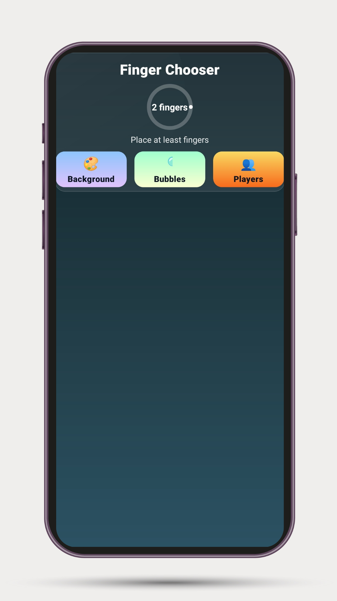
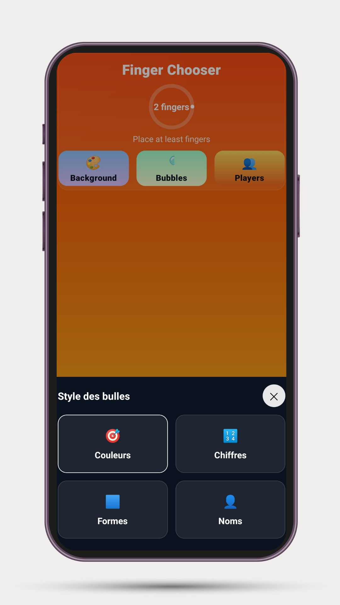
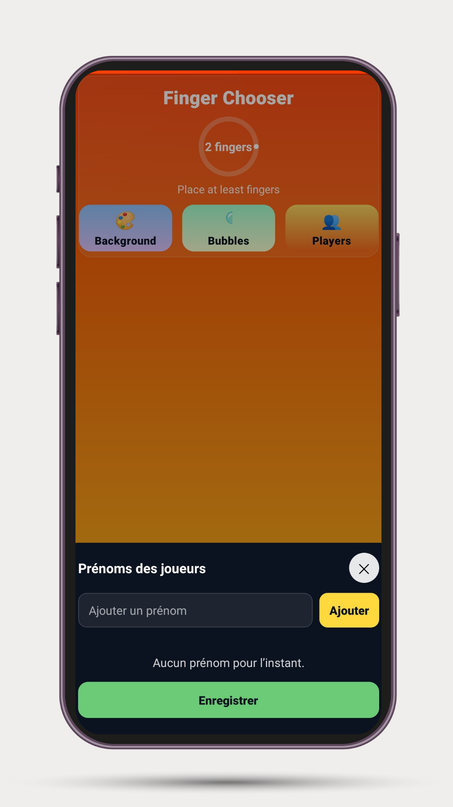
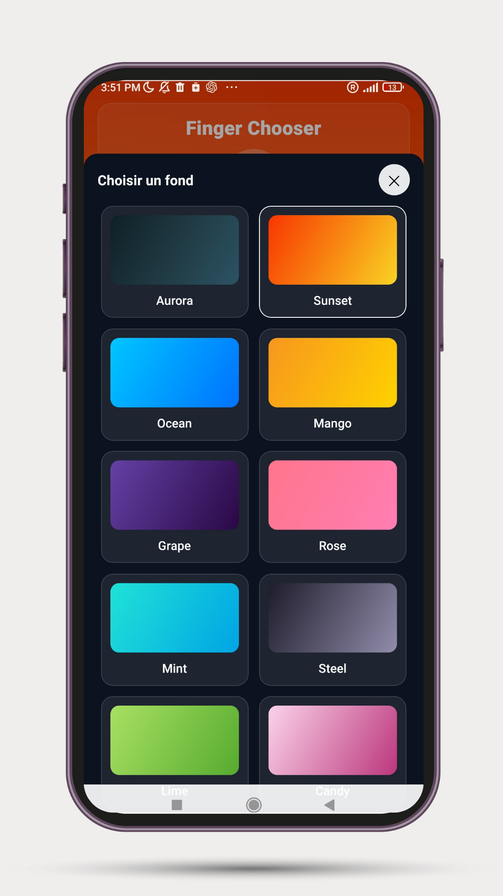

# Finger Chooser 🎉

Application mobile permettant de **choisir une personne au hasard en posant plusieurs doigts sur l’écran**.  
Idéal pour les jeux, les défis, les soirées, ou pour décider qui commence !

👉 **Télécharger l’APK (Android)**  
https://expo.dev/accounts/hafez_id/projects/finger-chooser/builds/68b5f23e-f773-4e88-9c2a-beef882d4417

---

## 📱 Aperçu de l'application

| Écran principal | Choix du style des bulles | Ajout des joueurs | Choix du fond |
|---|---|---|---|
|  |  |  |  |

---

## 🖐️ Comment ça marche ?

1. Les joueurs posent leur **doigt** sur l’écran
2. L’application détecte **chaque contact**
3. 1 doigt est choisi **au hasard**
4. 🎉 **Confettis + vibration** indiquent le gagnant

Simple • Rapide • Fun

---

## 🎨 Personnalisation intégrée

- Choix du **style des bulles** : couleurs / chiffres / formes / prénoms
- Ajout de **noms personnalisés**
- Sélection de thèmes d’arrière-plan **(Sunset, Ocean, Aurora, etc.)**
- Interface claire et épurée

---

## ✨ Fonctionnalités

| Fonction | Description |
|---|---|
| Multi-touch | Détection de plusieurs doigts en simultané |
| Random Fair Pick | Sélection équitable |
| Feedback haptique | Vibrations au moment du résultat |
| Confettis | Animation de célébration 🎉 |
| Personnalisation | Thèmes + noms + styles de bulles |

---

## 🧱 Stack Technique

- **React Native** + **Expo**
- **react-native-reanimated** (animations fluides)
- **expo-haptics**
- **EAS Build** pour `APK` et `AAB`

> ⚠️ **Le code source complet est privé**, mais peut être partagé en entretien sur demande.

---

## 🧠 Objectif du projet

Créer une expérience simple mais aboutie :
- UX **instantanée** (aucune friction)
- Multitouch réel
- Feedbacks visuels + tactiles
- Déploiement mobile **propre**

---

## 👨‍💻 Auteur

**Hafid Idrissi**  
DevOps & Full-Stack Engineer  
GitHub : https://github.com/HafidIdrissi  
LinkedIn : *(ajouter lien)*

---
